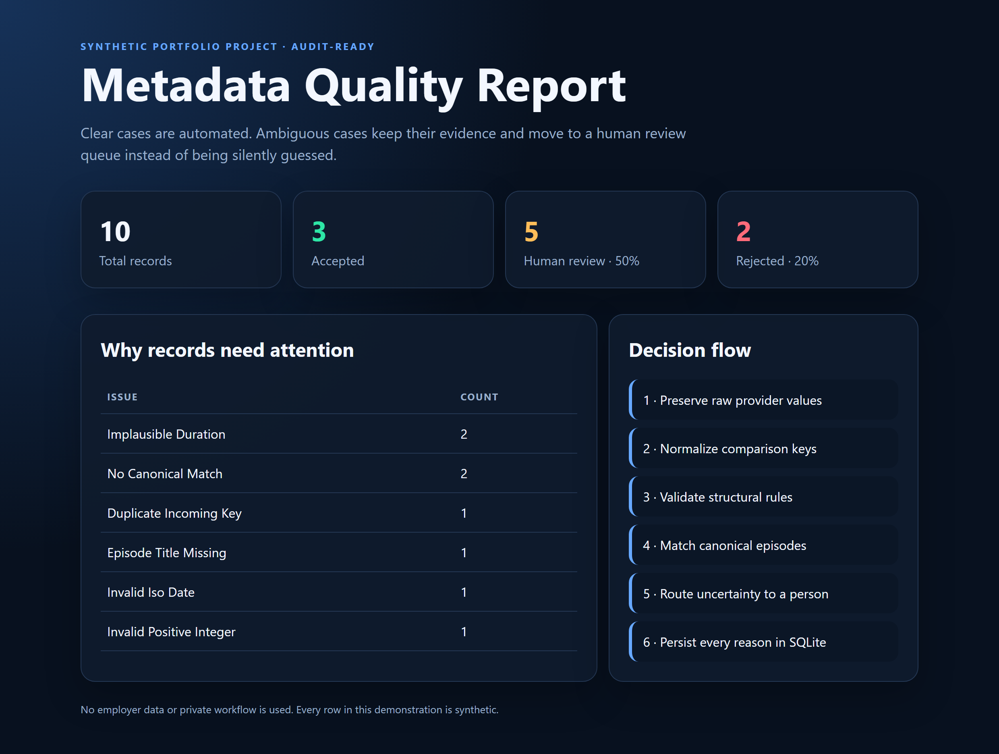
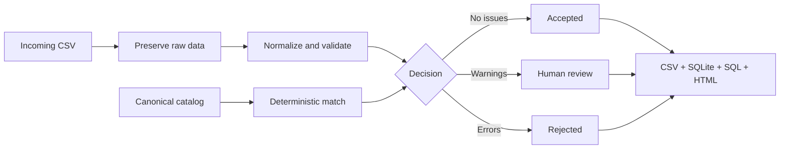

# Metadata Quality Pipeline

A reproducible Python and SQL portfolio project that turns messy, synthetic episode metadata into accepted records, rejected records, and a human-review queue.

This project is inspired by the general problem of metadata quality. It does **not** contain Reelgood data, company code, screenshots, private rules, or confidential workflows.



The dashboard above is produced by the run below. Nothing in it is edited by hand, and every row is synthetic.

## Verified sample result

Running the committed synthetic dataset produces:

```text
Total:    10
Accepted: 3
Review:   5
Rejected: 2
Issues:   8
```

The repository includes automated tests for normalization, validation, routing, SQLite persistence, output separation, and duplicate provider IDs.

The publication guard is tested too. Five tests cover it: three force it to reject a committed secret, a local Windows path, and a forbidden filename; one confirms an ordinary file produces no findings; and one proves the guard does not exempt its own test suite.

## The business problem

Entertainment metadata often arrives with:

- inconsistent capitalization and whitespace;
- missing or invalid season and episode numbers;
- duplicate provider records;
- dates in invalid formats;
- implausible duration values;
- titles that do not match the canonical catalog.

Blind automation is dangerous. This pipeline automates clear cases and sends ambiguous cases to a review queue with an explicit reason.

## What the pipeline does

1. Loads a canonical episode catalog and an incoming provider feed.
2. Normalizes text without destroying the original values.
3. Validates required fields, numbers, dates, and duration.
4. Matches records by normalized series title, season number, and episode number.
5. Detects duplicate incoming episode keys.
6. Assigns one status:
   - `ACCEPTED`: valid and matched;
   - `REVIEW`: usable but ambiguous, incomplete, duplicated, or unmatched;
   - `REJECTED`: structurally invalid.
7. Writes clean CSV outputs, a JSON summary, and a SQLite audit database.
8. Runs a SQL quality report over the results.

## Architecture



See [`docs/ARCHITECTURE.md`](docs/ARCHITECTURE.md) for decision boundaries, data lineage, and deliberate limitations.

See [`docs/PUBLICATION_SAFETY.md`](docs/PUBLICATION_SAFETY.md) for the privacy boundary and automated publication audit.

## Quick start

Works the same on Windows, macOS and Linux. From the project root:

```
python -m pip install -e .
metadata-quality
python -m unittest discover -s tests
```

`metadata-quality` runs the pipeline and writes to `output/`. The test command
runs the full suite. No third-party dependencies are required.

To run without installing, put `src` on the import path first — the syntax
differs per shell:

```
set PYTHONPATH=src            &:: Windows CMD
$env:PYTHONPATH = "src"       # Windows PowerShell
export PYTHONPATH=src         # macOS / Linux
```

then:

```
python -m metadata_quality.cli
python -m unittest discover -s tests
```

Generated files appear under `output/`:

- `processed_records.csv`
- `accepted_records.csv`
- `review_queue.csv`
- `rejected_records.csv`
- `quality_issues.csv`
- `quality_summary.json`
- `quality_dashboard.html`
- `metadata_quality.sqlite3`
- `quality_report.txt`

## Data lineage

The original provider values stay in `raw_records`. Normalized and matched values live in `processed_records`. Accepted, review, and rejected populations are exported separately. Every warning or error has a stable code in `quality_issues`. Duplicate provider IDs are preserved by source row and routed to review instead of crashing the audit database. This separation makes it possible to answer: what arrived, what changed, why it changed, and what still needs a person.

## Repository structure

```text
data/                  synthetic input files
sql/                   reusable quality report
src/metadata_quality/  pipeline source code
tests/                 automated tests
output/                generated artifacts, not committed
```

## Skills demonstrated

Python · CSV ingestion · normalization · deterministic matching · data-quality rules · exception handling · SQLite · SQL reporting · auditability · automated testing

## Quality gates

- The sample pipeline must finish without manual setup beyond Python.
- Automated tests run locally and in GitHub Actions on Python 3.11 and 3.12.
- A warning must never be silently treated as accepted.
- A rejected row must never be mixed into the human-review export.
- Duplicate provider identifiers must remain auditable and must not overwrite data.
- The publication audit must pass before a public push.

## Honest scope

This is a portfolio implementation, not a copy of an employer's system. It demonstrates how Renato thinks about data quality and how he is developing from manual data operations toward reproducible data validation and automation.
