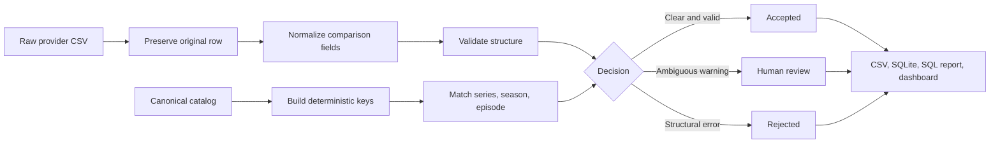

# Architecture and decision boundaries

This project treats metadata quality as a decision system, not only a cleaning script.

## Flow

## Why deterministic matching

The matching key is the normalized series title plus positive season and episode numbers. The project intentionally avoids fuzzy matching. A wrong automatic match is more damaging than an explicit `NO_CANONICAL_MATCH` warning that a person can investigate.

## Why source rows are database identities

Provider identifiers can be missing or duplicated in messy input. SQLite therefore uses the immutable CSV source row as the primary key and keeps `provider_record_id` as evidence. Duplicate provider IDs receive `DUPLICATE_PROVIDER_RECORD_ID` and move to review instead of crashing ingestion or silently overwriting a row.

## Decision contract

- `ACCEPTED`: no validation or matching issue.
- `REVIEW`: at least one warning, but no structural error.
- `REJECTED`: at least one error.

These populations are exported separately. The complete `processed_records` table remains the audit source for all decisions.

## Data lineage

- `raw_records` stores the original JSON representation and source row.
- `processed_records` stores normalized fields, canonical match, and final status.
- `quality_issues` stores a stable code, severity, field, observed value, and explanation.

This supports four questions: What arrived? What was normalized? Why was a decision made? Which rows still require a person?

## Deliberate limitations

- The dataset is synthetic and small.
- Matching is exact after normalization, not probabilistic.
- The HTML dashboard is static and dependency-free.
- The project demonstrates engineering method; it does not reproduce an employer's system or private workflow.
